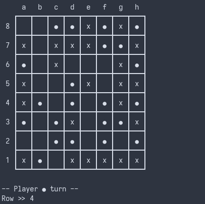
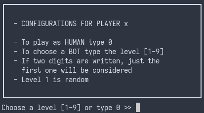

# Talpa - Avaliação Final

## Identificação 
- __Trabalho__: Talpa  
- __Grupo__: 3  
- __Turma Prática__: 3MIEIC06
- __Elementos__: 
    - Alexandre Almeida de Abreu Filho (up201800168)
    - Juliane de Lima Marubayashi (up201800175)

## Instalação
### Dependências
- SICStus - [download e instalação](https://sicstus.sics.se/eval.html)
- Código fonte - [.zip enviado diretamente para o professor](#) ou [GitHub](https://github.com/a3brx/talpa)

### Execução
#### Linux
O programa SICStus pode ser executado com o comando `caminho/até/sicstus/bin` (Considere atribuir um `alias` para esse caminho se ele for usado frequentemente).
#### Windows
Abra o programa SICStus.  

### Jogar
Para jogar Talpa temos que primeiramente consultar o código fonte baixado anteriormente, para isso usamos o comando `['caminho/até/talpa/main.pl'].`, para jogar execute o comando `play.` e divirta-se.

## Descrição do Jogo
Talpa é um jogo onde duas topeiras tentam cavar um caminho para cruzar o tabuleiro, cada uma em uma direção (vertical ou horizontal). Um caminho é uma sequência de casas vazias ortogonalmente conectadas, ou seja, podemos atravessá-lo somente com movimentos verticais e horizontais (diagonais não são permitidos).  
Mas se os dois jogadores conseguirem ter um caminho livre para cruzar o tabuleiro no mesmo turno, então o próximo jogador ganha.

Inicialmente, o jogo é preenchido com peças pretas e brancas dispostas como as casas de um tabuleiro de xadrez. O jogo é geralmente disputado num tabuleiro 8x8.

Um jogador pode mover uma de suas peças capturando uma peça inimiga na casa vertical ou horizontal adjacente. A peça capturada é removida do tabuleiro e substituída por uma peça do jogador que realizou o movimento.  
A captura é obrigatória quando possível. No entanto, se não houver nenhuma possível, um jogador deve remover uma de suas peças em seu turno.  

__Nota__: As peças do tabuleiro não precisam ser necessariamente pretas e brancas. É preciso apenas que se possa distinguir as peças de cada jogador. No caso utilizamos `x` e `o`.  

# Lógica do Jogo 

## Representação Interna do Estado do Jogo
- O estado do jogo é representado por uma lista de listas. Onde a representação das peças é feita da seguinte forma:  
-- 0: Casas vazias  
-- 1: Peças do jogador 1, `x`  
-- 2: Peças do jogador 2,`o`  
- Como há apenas dois jogadores, há dois possíveis valores para a variável do jogador atual: 1 ou 2.   
- Se as laterais verticais se conectarem o jogador `x` ganha. Se as laterais horizontais se conectarem o jogador `o` ganha.  

### Estados Possíveis de Jogo:
- Inicial:   

- Intermédio:  

- Final:   

## Visualização do estado do jogo

### Tabuleiro
Para a explicação da visualização do jogo é preciso ter em mente a existência das seguintes funções principais: 
- `print_board(+Board)`  
- `print_matrix(+Matrix)`  
- `print_middle_matrix(+Matrix)`  
- `print_first_row(+Row)`
- `print_row(+Row)`  
- `print_last_row(+Row)`  

A função principal é a `print_matrix` que encarrega-se de chamar todas as outras funções.  

Para desenhar a primeira linha é preciso chamar a função `print_first_row` que irá se encarregar de imprimir as letras correspondentes às colunas.  
Em seguida, a função `print_middle_matrix` irá imprimir o resto da matriz começando pelo número da linha seguido da posição das peças (de cada célula) da linha em questão.  
Ao chegar na última linha a ser impressa a função `print_middle_matrix` irá chamar a função `print_last_row` que irá printar os elementos e a borda inferior do tabuleiro.  

### Menus

#### Menu inicial:
O menu inicial contém 4 campos: Play, Board Dimensions, Language e Exit.  
Caso o usuário insira um número fora do indicado, será pedido para que o usuário tente inserir uma opção válida novamente. No entanto, se o usuário digitar mais de um carácter, apenas o primeiro será considerado e o restante do input será descartado.   
  

#### Escolha dos niveis e modalidade de jogo: 
Em sequência a escolha `play` no menu inicial, serão apresentados dois menus: um para as configurações do jogador `x` e outro para o jogador `o`.   
Para cada jogador há duas possibilidades de input:
- Se o usuário digitar o número 0, o player em questão será considerado um humano.   
- Caso contrário, deve-se digitar um número entre 1 e 9, o qual será o nível de dificuldade imposto ao bot.  

## Lista de Jogadas Válidas

O predicado `valid_moves(+Board, +Player, -ListOfMoves)` retorna a lista de jogadas válidas.  
Há dois tipos de jogadas válidas para o jogo: 
- A captura de uma peça inimiga 
- Remoção de uma peça do tabuleiro caso não seja possível realizar uma captura.  

Neste contexto, a função `valid_moves` procura todas as capturas possíveis e retorna os possíveis estados de jogo em `ListOfMoves`.
Caso capturas não sejam possíveis, estamos perante uma situação em que o usuário deve remover uma de suas peças, logo retorna-se todas os possíveis cenários distintos em que uma peça do jogador atual pode ser removida do tabuleiro.   

## Execução de Jogadas
O predicado `move(+GameState, +[Row-Column, Direction], -NewGameState)` faz as jogadas.

`GameState` é uma matriz que reprenta o tabuleiro `Row`, `Column` e `Direction` juntos representam o movimento, respectivamente a linha, coluna e direção representada por um carácter (cima 'w', baixo 's', esquerda 'a', direita 'd' ou remoção 'r').

Outros predicado importante para a execução de jogadas é `replaceInMatrix(+GameState, +Row-Column, +NewValue, -NewGameState)`, o argumento `NewValue` é calculado pelo predicado principal e representa o valor que irá substituir a posição.

O predicado `move` irá falhar caso a captura não seja possível, nomeadamente movimentos para células vazias e células já pertencentes ao jogador atual.

## Final do Jogo
O predicado `game_over(+Player-Board, -Winner)` é responsável pelo final do jogo, que é satisfeito se a partida já tem um vencedor.

`Board` é uma matriz que representa o tabuleiro e `Player` é o número do último jogador que fez uma jogada, esse argumento só é necessário caso os dois jogadores tenham atingido seu objetivo na última jogada, cenário em que o último jogador perde. O argumento `Winner` é o número do jogador que ganhou o jogo.

Esse predicado utiliza outros dois: `game_over_horizontal(+Board)` e `game_over_vertical(+Board)`, que verificam se a condição de vitória ocorreu horizontalmente ou verticalmente. Dependendo de qual jogador foi o último a jogar a ordem em que esses dois predicados são chamados pode variar.

## Avaliação do Tabuleiro
O predicado `value(+Board, +Player, -Value)` avalia em termos numéricos o quão bom é o atual tabuleiro `Board`, na perspectiva do jogador `Player`.  

Para que a avaliação do tabuleiro possa ser descrita de maneira lógica e sucinta, considere as seguintes sentenças:  
- O jogador `o` vence caso faça um caminho de células vazias na horizontal e o jogador `x` vence caso faça um na vertical.  
- Tome a função representativa `v(Player, Board)` como uma função que retorna o valor de um tabuleiro `Board` na perspectiva do jogador `Player`.  

Na implementação da função de avaliação de jogo é considerado que `v(o, Board) = -v(x,Board)`. Logo, caso `v(o, Board)` seja positivo, podemos afirmar que o jogador `o` está com a vantagem na partida.  

Para representar a avaliação do tabuleiro na perspectiva do jogador `o` é usada a seguinte fórmula: `value = maior(hps) - maior(vps)`, onde `hps` é o maior tamanho horizontal de um path e `vps` é o maior tamanho vertical.

Para exemplificar o que é um path, veja que que no tabuleiro a seguir há 2 paths:  

A path 1 possui `hps = 2` e `vps = 3`. Já a path 2, por ser uma célula única tem `hps = 1` e `vps = 1`.  
Neste caso `value = maior(hps) - maior(vps) = max(2, 1) - max(3, 1) = 2 - 3 = -1`.

## Jogada do Computador

O predicado `choose_move(+Board, +Player, +Level, -Move)` retorna um movimento possível para o computador de acordo com o nível `Level`.  

Utilizando os predicados `value` e `valid_moves` anteriormente descritos, a função `choose_move` procura todas jogadas possíveis para o tabuleiro `Board` juntamente com a sua avaliação: `Value-Board`. Tais são armazenados numa lista `ValuesMovesList`.   
Num passo seguinte, tabuleiros com o mesmo valor de avaliação `value` são agrupados em conjuntos de listas que são ordenados dentro de `ValuesMovesList`.  

Por exemplo, considere que para um determinado board `B1` temos os seguintes conjuntos de jogadas possíveis `Value-Board`:  
- v(Player, B2) = 3  
- v(Player, B3) = 5  
- v(Player, B4) = 3  
- v(Player, B5) = 5  
Então, tais conjuntos serão agrupados e ordenados em ordem crescente da seguinte forma: 
`ValidMovesList = [[B2, B4], [B3,B5]]`.  

Caso o nível do computador seja 2, por exemplo, será escolhido um tabuleiro aleatório na lista de index max(length(ValidMoves) + 2 - 10, 0) = 0 em `ValidMovesList`, ou seja, ou será escolhido o tabuleiro `B2` ou o tabuleiro `B4`.   
Caso o nível dado, seja maior que o número de elementos em `ValidMovesList`, o movimento a ser escolhido será um tabuleiro aleatório dentro da última lista de `ValidMovesList`.  

A única exceção é caso o nível do computador seja 1, nesse cenário o movimento escolhido é completamente aleatório e não é realizada validação.  

Caso não hajam capturas possíveis, o computador irá realizar o mesmo procedimento para a remoção de uma de suas peças.  

# Conclusões
O trabalho permitiu que tivéssemos contacto com a linguagem de programação Prolog que se mostrou muito útil em algumas situações, por exemplo a criação do bot.  
O contacto com uma linguagem de programação lógica permite-nos fazer programas de um modo diferente do imperativo e com muitas vantagens em específicos projetos.

As maiores dificuldades encontradas pelo grupo foram a leitura de input do usuário e a construção do bot, em ambas a ajuda do nosso professor Daniel Castro Silva foi de grande importância.

O trabalho pode ser melhorado em alguns aspectos:
- Utilização de uma estratégia melhor para o valor do tabuleiro (por exemplo Minimax)
- Movimentação das peças com o rato
- Menu de configurações
- Adição de cores para os diferentes jogadores
- Otimização das funções
- Simplificação de código

# Bibliografia
[BoardGameGeek](https://boardgamegeek.com/boardgame/80657/talpa)  
[igGameCenter](http://www.iggamecenter.com/info/pt/talpa.html)  
[nestorgames](https://nestorgames.com/#talpa_detail)
[Documentação do SICStus](https://sicstus.sics.se/sicstus/docs/latest4/html/sicstus.html/)  
[Aulas de Programação em Lógica](https://sigarra.up.pt/feup/pt/ucurr_geral.ficha_uc_view?pv_ocorrencia_id=459482)  
